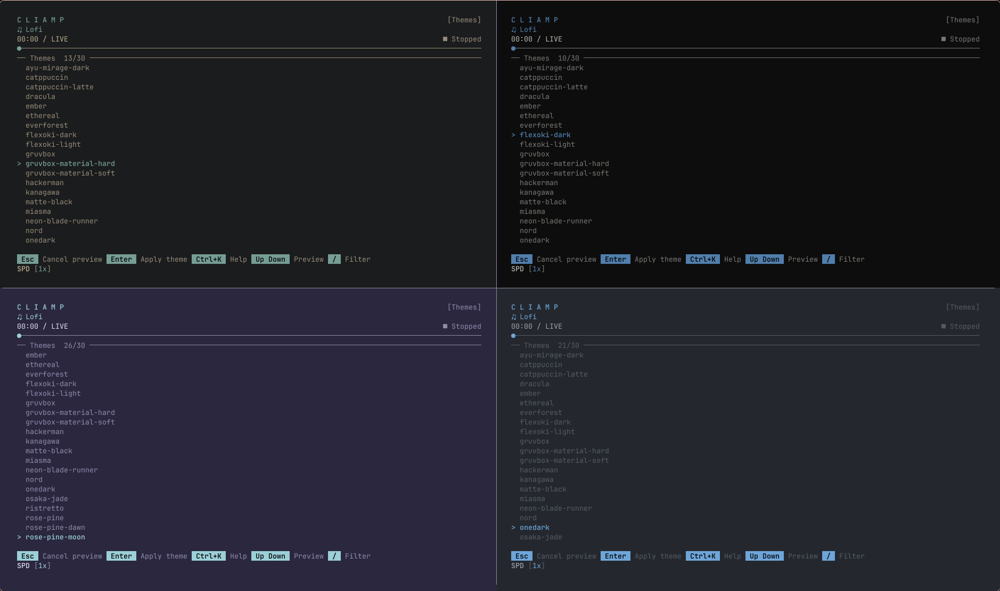

# better-cliamp-themes

Extra themes for [cliamp](https://github.com/bjarneo/cliamp). Drop-in files, no rebuild needed — user themes override built-ins with the same name.



## Themes

| Theme | Source |
|---|---|
| `rose-pine` | Rosé Pine Main (dark). Overrides the built-in light one on purpose |
| `rose-pine-moon` | Rosé Pine Moon |
| `rose-pine-dawn` | Rosé Pine Dawn (light) |
| `gruvbox-material-hard` | Gruvbox Material dark, hard contrast (`bg #1D2021`) |
| `gruvbox-material-soft` | Gruvbox Material dark, soft contrast (`bg #32302F`) |
| `flexoki-dark` | Flexoki dark |
| `solarized-dark` | Solarized dark |
| `onedark` | Atom OneDark |

## Install

### Windows

```powershell
irm https://raw.githubusercontent.com/4irF1ux/better-cliamp-themes/main/install-remote.ps1 | iex
```

### Linux

```sh
curl -fsSL https://raw.githubusercontent.com/4irF1ux/better-cliamp-themes/main/install-remote.sh | sh
```

Then run cliamp and pick a theme:

```sh
cliamp theme list
cliamp --start-theme "rose-pine"
```

Manual (clone first, only if the lines above don't work for you):

### Windows

```powershell
git clone https://github.com/4irF1ux/better-cliamp-themes
cd better-cliamp-themes
.\install.ps1 --all
```

### Linux

```sh
git clone https://github.com/4irF1ux/better-cliamp-themes
cd better-cliamp-themes
./install.sh --all
```

## Format

Seven keys, `bg` optional (empty = terminal background). The six foreground
keys are required in `#RRGGBB`:

```toml
bg = "#1a1b26"
accent = "#7aa2f7"
bright_fg = "#cfc9c2"
fg = "#848cb8"
green = "#9ece6a"
yellow = "#e0af68"
red = "#f7768e"
```

## Requests

Open an issue with the palette source and I'll take a look.
